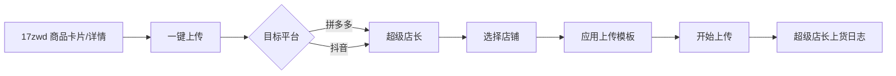
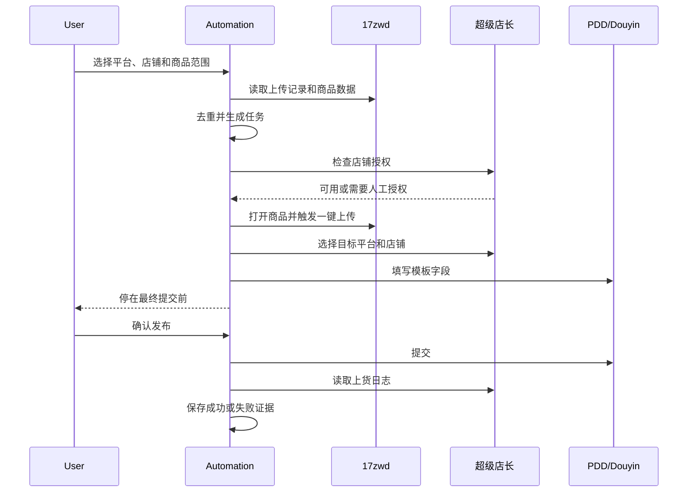

# 17zwd 多平台铺货自动化技术设计

## 1. 结论

项目采用“浏览器流程编排”，而不是“私有接口逆向”。

推荐技术栈：

- Python 3.14：当前机器已安装的版本。
- Playwright：驱动有头浏览器并维护长期登录态。
- SQLite：保存商品、任务、执行记录和失败原因。
- pytest：验证数据转换、去重和任务状态机。
- Pydantic：约束商品、店铺、平台任务的数据结构。

现有自动化链路：



项目负责：

- 发现和采集待铺货商品。
- 与历史铺货记录对账。
- 生成平台发布任务。
- 驱动浏览器完成重复操作。
- 在风险点暂停并要求人工确认。
- 保存执行证据并支持失败重试。

项目不负责：

- 绕过验证码、风控或平台权限。
- 未授权地操作他人账号。
- 直接调用超级店长或平台的私有接口。
- 在第一版中自动点击最终发布按钮。

## 2. 已确认的页面行为

### 2.1 上传记录页

页面：`https://i.17zwd.com/user/uploadRecord`

页面属性：

- 平台通过标签切换，包括淘宝、拼多多、抖音等。
- 每条记录包含标题、货源货号、价格、档口、类目和铺货时间。
- 数据行包含稳定的 `data-row-key`。
- “找同款”地址包含来源 `goods_id`。
- 页面适合搜索、对账和生成任务，不适合直接编辑商品。

当前账号状态：

- 拼多多：206 条已铺货记录，4 条下架货源记录。
- 抖音：0 条已铺货记录，0 条下架货源记录。

### 2.2 铺货设置

页面：`https://i.17zwd.com/user/uploadSetting`

拼多多和抖音当前配置一致：

- 一键上传应用：超级店长。
- 默认上传方式：编辑上传。
- 两个平台都可以单独设置模板和上传模式。

“编辑上传”意味着每次上传先进入平台编辑流程。第一版保留该模式，
在最终提交前暂停，避免错误类目、错误价格或错误店铺造成直接发布。

### 2.3 网店管理

页面：`https://t-onekey.17zwd.com/shopManage`

页面在跨域 iframe 中加载超级店长。

当前账号状态：

- 已绑定多只拼多多店铺。
- 部分拼多多店铺授权已过期。
- 未发现已绑定的抖音店铺。

抖音上货的硬前置条件：先绑定至少一只可用抖店。

## 3. 领域模型

### 3.1 SourceProduct

```text
source_goods_id       17zwd 商品 ID，来自找同款链接
source_row_key        上传记录行的 data-row-key
title                 商品标题
source_sku            商家货号
price                 货源价格
source_shop           档口名称
source_category       17zwd 类目
image_url             主图地址
uploaded_at           记录页显示的铺货时间
source_platform       记录来自淘宝、拼多多或抖音标签
```

### 3.2 PublishTask

```text
task_id               本地唯一任务 ID
source_goods_id       来源商品 ID
target_platform       pinduoduo 或 douyin
target_shop_id        超级店长中的店铺 ID
template_id           上传模板 ID
mode                  edit 或 direct
status                当前任务状态
attempt_count         已经执行的次数
last_error            最近一次错误
created_at            创建时间
updated_at            更新时间
```

任务唯一键：

```text
source_goods_id + target_platform + target_shop_id
```

这个唯一键保证同一商品不会在同一个店铺重复发布。

### 3.3 任务状态

```text
DISCOVERED       已从来源发现
READY            数据完整，可以执行
NEEDS_HUMAN      登录、授权、验证码或字段冲突需要人工处理
RUNNING          正在浏览器中执行
PAUSED_CONFIRM   已填到最终提交前，等待人工确认
SUCCEEDED        已确认上传成功
FAILED           执行失败，可重试
SKIPPED          已存在或用户选择跳过
```

状态变化必须由任务服务统一处理，页面对象不能直接更新状态。

## 4. 组件设计

```text
src/pdd_listing_automation/
  app.py                        CLI 入口
  config.py                     环境、路径和运行参数
  models.py                     领域模型和状态枚举
  browser/
    session.py                  持久化浏览器会话
  pages/
    upload_records.py           上传记录采集
    product_search.py           商品详情/搜索结果解析
    superboss.py                超级店长店铺和上传流程
  services/
    discovery.py                来源商品采集和去重
    preflight.py                授权、价格、图片和类目检查
    publisher.py                发布任务状态机
  storage/
    database.py                 SQLite 初始化
    repositories.py             商品、任务和运行日志仓储
  reports/
    exporter.py                 CSV、JSON 和运行摘要
```

## 5. 浏览器策略

- 默认使用有头模式，不使用无头模式伪装正常用户。
- 使用持久化浏览器目录保存登录态。
- 不保存账号密码、短信验证码或平台令牌。
- 验证码、扫码登录和授权过期时暂停任务并通知人工。
- 默认单并发、单浏览器窗口，降低风控和误操作概率。
- 每一步使用页面语义、`data-*` 属性或稳定的业务字段定位。
- 不依赖动态 CSS 类名或页面上的绝对坐标。
- 页面改版或定位失败时保留截图和 DOM 快照。
- 对相同失败最多自动重试两次，之后进入 `NEEDS_HUMAN`。

## 6. 标准执行流程



## 7. 数据存储

SQLite 至少包含四张表：

- `source_products`：来源商品快照。
- `shops`：平台、店铺名称、授权状态和最近检查时间。
- `publish_tasks`：发布任务及当前状态。
- `task_runs`：每次执行的开始、结束、结果、错误和截图路径。

默认启用幂等：

- 执行前检查任务唯一键。
- 执行中使用独占锁。
- 页面操作失败后先检查是否已经在目标平台存在。
- 不允许因为超时就盲目重复提交。

## 8. 实施阶段

### P0：采集和对账

交付：

- 持久化浏览器会话。
- 拼多多和抖音上传记录采集。
- 商品去重并导出 CSV 和 JSON。
- 店铺授权状态读取。

验收：

- 可以读取全部 206 条拼多多记录。
- 可以识别抖音记录为 0。
- 重复运行不会产生重复任务。
- 登录失效时任务暂停且提示人工处理。

### P1：拼多多单商品闭环

交付：

- 从一条来源商品触发一键上传。
- 自动选择拼多多店铺和模板。
- 停在最终提交前等待人工确认。
- 成功后保存截图和运行日志。

验收：

- 使用一只已授权拼多多店铺完成一次测试。
- 不产生重复商品。
- 任意失败都能定位到具体步骤。

### P2：抖音单商品闭环

前置：

- 绑定至少一只可用抖店。
- 在铺货设置中确认抖音模板。

交付：

- 复用拼多多流程，只替换目标平台参数。
- 单独记录抖音店铺授权和上传结果。

### P3：批量与调度

交付：

- 批量队列、速率限制、断点续跑。
- 每日增量扫描。
- 失败重试和人工待办列表。
- 上传结果报表。

## 9. 风险

- 超级店长属于第三方付费服务，可能有订购费用和平台规则变化。
- 已有拼多多店铺授权过期，批量执行前必须先处理授权。
- 当前没有抖音店铺，抖音链路无法进行真实验收。
- 上传记录不是新商品列表；需要先确定每日新商品的来源。
- 平台页面和超级店长 iframe 可能随时调整。
- “编辑上传”需要处理类目、规格、价格、库存和平台属性映射。

## 10. 开工前必须确定

- 拼多多目标店铺是哪一只或哪几只。
- 抖音是否有可用店铺，以及计划绑定到哪个账号。
- 待铺货商品来自上传记录、收藏、搜索页还是其他商品列表。
- 是否需要“一键上传”支持批量选择。
- 是否允许在人工确认后继续自动点击发布。
